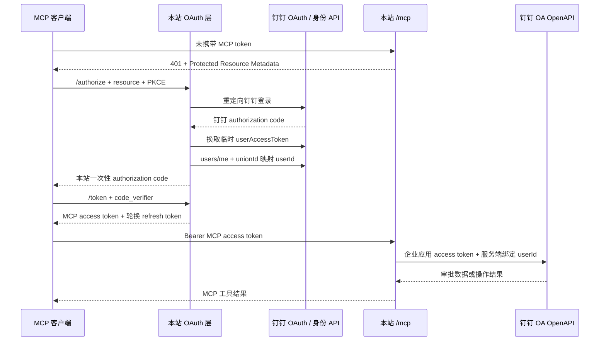

# 自托管 MCP 鉴权模块设计

日期：2026-08-14
状态：代码已实现并通过本地验证；生产 `/mcp` 状态以 CVM 部署与公网实测结果为准
适用资源：`https://dingtalk.mwexk.com/mcp`

## 1. 设计结论

采用两层、两种用途完全分离的凭据：

1. **MCP 客户端登录层**：本站作为 MCP OAuth 授权服务器，钉钉仅作为上游身份提供方。客户端完成 OAuth 2.1 授权码 + PKCE S256，本站验证真实钉钉企业用户后，签发仅能访问 `https://dingtalk.mwexk.com/mcp` 的 MCP access token。
2. **钉钉 OpenAPI 调用层**：审批服务继续使用“`MWE审批MCP` 企业内部应用”的 App ID/AppKey + App Secret/AppSecret 获取应用 access token。该凭据永不下发给 MCP 客户端。

钉钉 `userAccessToken` 只在 OAuth 回调期间用于验证登录用户，不作为 MCP Bearer、不写日志、不持久化，也不用于替代企业应用凭据。



## 2. 目标与非目标

### 目标

- 让 MCP 服务知道调用者的真实 `corpId + unionId + userId`，无需维护用户密码。
- 遵循 MCP HTTP Authorization：OAuth 2.1、PKCE S256、Protected Resource Metadata、Authorization Server Metadata、resource/audience 绑定。
- 调用者身份由服务端注入 `approval_task`，模型输入不能提供或覆盖身份。
- 支持短期 access token、refresh token 轮换、撤销和密钥轮换。
- 保持鉴权模块为深模块：HTTP 层只负责挂载路由、保护 `/mcp`、取得可信 Principal。
- 单机版本可以运行在当前 CVM；未来横向扩展时只替换状态存储 Adapter。

### 非目标

- 不把钉钉建设成 MCP resource server，也不让钉钉直接签发 MCP token。
- 不使用 AIHub、`mcp-gw.dingtalk.com` 或 AIHub `key`。
- 不改变审批 OpenAPI 的企业应用鉴权方式。
- 不在首版建立员工密码库、完整用户目录、角色管理后台或长期钉钉用户会话。
- 不用 cookie 认证 `/mcp`，不接受 query-string token。

## 3. 深模块边界

鉴权对 HTTP/MCP 层只暴露一个小 Interface：

```ts
export type McpScope = "approval:read" | "approval:decide";

export interface McpPrincipal {
  subject: string;       // unionId；只来自钉钉验证结果
  tenantId: string;      // corpId；必须等于配置的目标企业
  userId: string;        // unionId 经企业应用接口映射出的钉钉 userId
  clientId: string;
  scopes: readonly McpScope[];
  authenticatedAt: number;
}

export interface McpAuthorizationModule {
  readonly router: import("express").Router;
  requireAccess(scopes?: readonly McpScope[]): import("express").RequestHandler;
  principal(auth: import("@modelcontextprotocol/sdk/server/auth/types.js").AuthInfo): McpPrincipal;
}
```

这个 Interface 是模块的测试面。外部调用方不能接触授权码、钉钉用户 token、refresh token 哈希、JWT 私钥或事务存储。

建议入口：

```ts
createMcpAuthorization(config: McpAuthConfig, dependencies: McpAuthDependencies): McpAuthorizationModule
```

内部由以下 Seam/Adapter 组成：

|内部 Interface|生产 Implementation|职责|
|---|---|---|
|`DingTalkIdentityPort`|`DingTalkOAuthIdentityAdapter`|构造钉钉登录 URL、换取临时用户 token、读取 `users/me`、映射企业 `userId`|
|`AuthorizationStore`|`DirectoryAuthorizationStore`（单实例首版）|一次性事务、授权码、refresh token family、客户端注册、撤销状态与 TTL 清理|
|`McpTokenCodec`|`JoseMcpJwtCodec`|签发和验证短期、限 audience/scope 的 JWT|
|`Clock` / `RandomSource`|系统 Adapter|可测试的时间、随机码和 nonce|
|`SecurityAuditSink`|受限 JSONL Adapter|记录安全事件，不记录 token、code、完整身份或回调参数|

测试使用内存 Store、固定 Clock/RandomSource 和假的 `DingTalkIdentityPort`。不要 mock `McpAuthorizationModule` 内部实现；测试应从它的公开 Interface 和 OAuth HTTP 端点进入。

## 4. OAuth 端点与 MCP 路由

统一部署在 `https://dingtalk.mwexk.com`，issuer 必须来自配置，禁止根据不可信 `Host`/`X-Forwarded-Host` 动态生成。

|端点|用途|
|---|---|
|`GET /.well-known/oauth-protected-resource/mcp`|声明 resource、授权服务器和可用 scope|
|`GET /.well-known/oauth-authorization-server`|声明 issuer、authorize/token/register/revoke、PKCE S256|
|`GET/POST /authorize`|接受 MCP 客户端授权请求并转向钉钉|
|`GET /oauth/dingtalk/callback`|仅接收钉钉 OAuth 回调|
|`POST /token`|本站授权码或 refresh token 换 MCP token|
|`POST /register`|受限动态客户端注册，保证 Codex 等公共客户端兼容|
|`POST /revoke`|撤销本站 refresh token family；access token 最迟在短 TTL 后失效|
|`POST /mcp`|Streamable HTTP MCP 请求|
|`GET/DELETE /mcp`|按 MCP SDK 语义处理；首版使用无状态 transport，不创建服务端会话|
|`GET /healthz`|存活检查，不泄露 OAuth 配置和用户信息|

使用 `@modelcontextprotocol/sdk` 1.30.0 的 `mcpAuthRouter`、`requireBearerAuth` 和 `StreamableHTTPServerTransport`，不要自行实现协议报文。SDK 当前固定在元数据中声明 `authorization_code` 与 `refresh_token`，因此生产 Provider 必须真实实现 refresh token，不能照抄其 demo 中的 `Not implemented`。

## 5. 完整授权流程

### 5.1 MCP 客户端开始授权

1. 客户端访问 `/mcp` 未带有效 token。
2. 服务返回 401，并在 `WWW-Authenticate` 中附：

   ```text
   resource_metadata="https://dingtalk.mwexk.com/.well-known/oauth-protected-resource/mcp"
   ```

3. 客户端发现本站授权元数据后调用 `/authorize`，必须包含：
   - `response_type=code`
   - 已注册 `client_id` 和回调 URI
   - `code_challenge_method=S256`
   - `code_challenge`
   - `resource=https://dingtalk.mwexk.com/mcp`
   - `scope=approval:read`，需要审批决定能力时再加 `approval:decide`
4. 本站验证客户端、redirect URI、scope 和 resource，创建 5 分钟、单次使用的授权事务。

### 5.2 转向钉钉并确认身份

1. 本站生成独立上游 `state`，绑定本地事务，重定向到：

   ```text
   https://login.dingtalk.com/oauth2/auth
   ```

2. 固定使用已配置的企业内部应用与 HTTPS 回调 URI；请求 `openid corpid`，并将目标企业 `corpId` 作为企业选择边界。
3. 回调严格核对单次 `state` 和 5 分钟 TTL，然后后端向钉钉换取 `userAccessToken`。
4. 校验 token 响应中的 `corpId` 精确等于 `DINGTALK_CORP_ID`。
5. 用临时用户 token 调 `GET /v1.0/contact/users/me` 获取可信 `unionId`。
6. 用企业应用 token 调 unionId 映射接口得到该企业的 `userId`。
7. 映射失败、用户不属于目标企业或钉钉 API 返回异常时，授权失败关闭；不签发本站授权码。
8. 用户 token 与钉钉 refresh token 使用完立即丢弃，不进入 Store、audit 或异常上下文。

### 5.3 签发本站凭据

1. 本站向原 MCP 客户端回调 URI 返回一次性授权码和原始客户端 `state`。
2. `/token` 验证：client、redirect URI、resource、授权码未使用、未过期，以及 PKCE verifier。
3. 签发：
   - MCP access token：非对称签名 JWT，默认 10 分钟。
   - MCP refresh token：256 bit 不可猜 opaque token，默认 8 小时；服务端只保存 SHA-256 哈希。
4. refresh token 每次使用都轮换；旧 token 再次出现时，撤销整个 token family，阻止重放。
5. 客户端显式 `/revoke` 时撤销 refresh family。已签发 access token 通过 10 分钟上限自然失效；紧急事件可停用签名 `kid` 立即全局失效。

## 6. MCP token 契约

Access token 使用 `EdDSA`（Ed25519）或部署环境稳定支持的 `ES256`；不得使用共享的钉钉 App Secret 作为 JWT 密钥。

必需 claims：

|claim|值/验证规则|
|---|---|
|`iss`|`https://dingtalk.mwexk.com/`，与授权服务器元数据精确匹配|
|`aud`|`https://dingtalk.mwexk.com/mcp`，精确匹配|
|`sub`|可信 `unionId`|
|`tid`|可信 `corpId`|
|`uid`|可信企业 `userId`|
|`client_id`|发起授权的 MCP client|
|`scope`|空格分隔的允许 scope|
|`auth_time`|本次钉钉身份验证时间|
|`iat` / `nbf` / `exp`|签发、最早使用、过期时间；允许的时钟偏差最多 60 秒|
|`jti`|高熵唯一 ID|
|`kid`|签名密钥版本，用于轮换与紧急停用|

`verifyAccessToken` 完成签名、算法白名单、issuer、audience、时间、scope、tenant 和 claim 类型验证后，将身份放入 SDK `AuthInfo.extra`。`principal()` 只接受这份已验证的 `AuthInfo`，不解析请求 body 或任意 header 中的身份字段。

## 7. 客户端注册策略

首版启用 SDK 动态客户端注册以兼容桌面 MCP 客户端，但 Store 必须实施额外约束：

- 动态注册只接受公共客户端：`token_endpoint_auth_method=none` + PKCE S256。若未来需要 `client_secret_post`，只允许预注册的机密客户端，其 secret 必须加密落盘；不要让 DCR 创建机密客户端。
- 仅允许 `https:` 回调；原生桌面客户端允许 `http://127.0.0.1`、`http://localhost` 或 `http://[::1]`，仅端口可以变化，scheme/host/path/query 必须匹配。
- 禁止通配域名、用户信息、片段、非 loopback 明文 HTTP 和私网任意回调。
- 限制每 IP/时间窗口的注册数、每客户端回调数、metadata 长度和总客户端数。
- 客户端记录需要 TTL 和清理；公开客户端不生成或保存无意义的 client secret。
- 上线前用真实 Codex MCP OAuth 客户端做一次注册、登录、刷新、撤销兼容测试；如实际客户端支持 Client ID Metadata Documents，再考虑收紧或替换 DCR。

## 8. 审批域身份注入

当前 `ApprovalService` 在单例中保存 `callerUserId`/`writeUserIds`，不能服务多个 OAuth 用户。实现时应改为显式的逐请求上下文：

```ts
export interface ApprovalCaller {
  tenantId: string;
  subject: string;
  userId: string;
  scopes: readonly McpScope[];
}

approvalTask(caller: ApprovalCaller, input: ApprovalTaskInput): Promise<ApprovalTaskEnvelope>
```

`createApprovalMcpServer(service, { caller })` 在每个无状态 Streamable HTTP 请求中捕获已认证 caller，再注册现有的单一 `approval_task` 工具。身份不得加入工具 schema，也不使用安全边界不清晰的全局变量或 `AsyncLocalStorage`。

动作授权规则：

|动作|scope|额外业务检查|
|---|---|---|
|`view`|`approval:read`|实例必须与 caller 相关：当前/历史任务执行人、发起人或官方详情中可验证的参与者；无法证明则拒绝|
|`approve`|`approval:read approval:decide`|保留 `confirm: true`、幂等保护；重新读取实例并确认当前任务仍分配给 caller `userId`|
|`reject`|`approval:read approval:decide`|同上，并要求非空业务原因|

附件临时链接的 userId 也必须来自 caller。MCP 服务仍只返回经 host allowlist 验证的临时 HTTPS 链接，不下载、解析或 OCR。

生产配置不再提供 `DINGTALK_CALLER_USER_ID` 或 `DINGTALK_WRITE_USER_IDS`。调用者只能来自已验证的逐请求 OAuth Principal；写操作继续实时确认当前任务确实属于 caller。

## 9. 状态存储与扩展

首版 CVM 单实例使用 `DirectoryAuthorizationStore`，与应用容器挂载独立持久卷。它只保存：

- OAuth 客户端 metadata；公共客户端没有 secret。可选的预注册机密客户端 secret 使用独立存储密钥加密，SDK 鉴权时才在内存中解密。
- 5 分钟授权事务和授权码；文件名使用随机值的哈希。
- refresh token family 和 token 哈希、scope、client、主体、过期/撤销状态。
- 被紧急停用的 JWT `kid` 或 `jti`（仅在确有紧急撤销需求时）。

必须使用原子 create/rename、单次消费、大小上限、严格文件权限、启动/写入/空闲定时清理。不得保存钉钉 user/refresh token、MCP access token 明文、审批内容或附件 URL。

未来多副本或高并发部署时只增加 `RedisAuthorizationStore` Adapter，保持 `McpAuthorizationModule`、OAuth Provider 和审批 Interface 不变。切换前必须验证原子 token 轮换、重放检测和 TTL 语义。

## 10. 配置与 Secret

建议新增：

```dotenv
MCP_PUBLIC_URL=https://dingtalk.mwexk.com/mcp
MCP_ISSUER_URL=https://dingtalk.mwexk.com/
DINGTALK_CORP_ID=<目标企业 corpId>
DINGTALK_OAUTH_REDIRECT_URL=https://dingtalk.mwexk.com/oauth/dingtalk/callback
MCP_SIGNING_PRIVATE_KEY_FILE=/run/secrets/mcp_signing_private_key.pem
MCP_SIGNING_KEY_ID=<版本化 kid>
MCP_AUDIT_HMAC_KEY_FILE=/run/secrets/mcp_audit_hmac_key
MCP_ACCESS_TOKEN_TTL_SECONDS=600
MCP_REFRESH_TOKEN_TTL_SECONDS=28800
MCP_AUTH_TRANSACTION_TTL_SECONDS=300
MCP_AUTH_STORE_PATH=/data/auth
MCP_ALLOWED_SCOPES=approval:read,approval:decide
```

继续沿用：

```dotenv
DINGTALK_CLIENT_ID=<MWE审批MCP App ID/AppKey>
DINGTALK_CLIENT_SECRET=<MWE审批MCP App Secret/AppSecret>
```

签名私钥、审计 HMAC key 与 App Secret 使用 Docker Secret 或权限严格的宿主机 secret 文件挂载，不进入镜像、Compose 明文、Git、日志或审计。当前只接受公共 PKCE 客户端，不生成或存储 confidential client secret。

钉钉开发者后台需要精确配置 OAuth 回调 URI，并确认应用具备“登录用户身份/个人信息”和 unionId 映射 userId 所需权限。审批 OpenAPI 权限继续按已有企业应用配置管理，两者不要混为一个 scope 列表。

## 11. 审计与隐私

OAuth 安全日志与现有工具调用日志分流，但共用最长 30 个 UTC 日保留策略：

- 可记录：随机关联 ID、阶段、结果、标准化错误码、client 类别、scope 集、耗时、签名 `kid`、主体的 HMAC 伪匿名值。
- 不记录：access/refresh token、授权码、PKCE verifier/challenge、DingTalk code/user token、App Secret、完整 redirect URI query、原始 corpId/unionId/userId。
- 登录成功和工具调用使用同一种不可逆、带服务端审计盐的主体伪名，以便追踪安全事件而不把真实身份写入 JSONL。
- 授权失败、token 重放、企业不匹配、scope 拒绝和撤销需要单独的 bounded event；不得把未经清洗的上游异常序列化进日志。

## 12. HTTP 组合与迁移边界

当前 raw `node:http` 路由应迁移到 SDK 推荐的 Express 组合层：

```text
createMcpExpressApp()
  ├─ auth.router                         # metadata / authorize / token / register / revoke
  ├─ /oauth/dingtalk/callback            # upstream IdP adapter callback
  ├─ /mcp + requireAccess()              # Streamable HTTP, per-request server/transport
  └─ /healthz
```

`/platform/tools/*` 与 `MCP_PLATFORM_API_KEY` 已明确退役，不实现兼容路由；旧路径统一返回 404。

建议新增或调整的代码位置：

```text
src/auth/types.ts
src/auth/mcp-authorization.ts
src/auth/dingtalk-identity.ts
src/auth/authorization-store.ts
src/auth/jwt-codec.ts
src/auth/security-audit.ts
src/transports/streamable-http.ts
src/approval/service.ts               # caller 改为显式参数
src/mcp/create-server.ts              # 每请求注入 caller
src/config.ts                         # 新增鉴权配置并校验 canonical URL
```

新增直接依赖应明确声明，不依赖 SDK 的传递依赖：`express`、`@types/express`、`jose`。继续只提供 Streamable HTTP，不增加 stdio。

## 13. 实施顺序

### P0：协议骨架与身份边界

1. 增加配置校验、Principal、Port、Store Interface 和测试 Adapter。
2. 实现受限客户端 Store、授权事务、PKCE 授权码和 refresh token 轮换。
3. 实现 JWT codec 与 bearer 验证。
4. 挂载元数据、OAuth 端点和受保护的无状态 `/mcp`。

### P1：钉钉身份 Adapter

1. 实现钉钉 authorize URL、回调 state、code exchange。
2. 验证 `corpId`，调用 `users/me`，再映射 `unionId -> userId`。
3. 增加上游超时、失败关闭、secret-safe 错误和安全审计。

### P2：审批服务按请求身份化

1. 将 `ApprovalService` 的固定 caller 改为显式 `ApprovalCaller`。
2. 为 view/approve/reject 增加 scope 和实例关系检查。
3. 保持现有重新读取、幂等、确认、附件链接和审计约束。

### P3：生产联调与迁移

1. 开发者后台登记精确回调 URI、申请所需用户身份权限。
2. 配置签名私钥、持久 auth 卷、HTTPS 反向代理和可信代理边界。
3. 用真实 Codex 客户端完成 DCR、登录、刷新、撤销和过期测试。
4. 经公网 URL 通过 `initialize`、`tools/list`、一次 `view`、一次 dry-run 决策操作。
5. 确认旧 `/platform/tools/*` 路径持续返回 404。

## 14. 验收门槛

- 未认证 `/mcp` 返回带正确 `resource_metadata` 的 401。
- 元数据只公布实际可用端点、scope 和 HTTPS canonical URL。
- 缺少/错误 `resource`、错误 audience、非 S256、redirect 不匹配、过期/复用 state 或 code 均失败关闭。
- 非目标 `corpId`、客户端自报 userId、映射失败均不能获得本站 token。
- access token 过期、签名算法混淆、错误 `iss/aud/kid`、缺 scope 均被拒绝。
- refresh token 单次轮换；旧 token 重放会撤销整个 family；`/revoke` 生效。
- 同时登录的两个真实钉钉用户不会共享 caller，工具输入无法覆盖身份。
- `view` 不得通过枚举实例 ID 越权；approve/reject 必须再次确认实时任务属于 caller。
- 鉴权日志与工具日志均不含 token、code、真实身份和附件 URL，最长保留 30 天。
- 从公网 `https://dingtalk.mwexk.com/mcp` 实测 MCP `initialize`、`tools/list`、`approval_task(view)` 和 dry-run 写操作成功后，才可标记生产 MCP 可用。

## 15. 依据

- [钉钉 OAuth 作为 MCP 客户端鉴权的研究结论](./dingtalk-oauth-mcp-client-auth.md)
- [MCP Authorization 2025-11-25](https://modelcontextprotocol.io/specification/2025-11-25/basic/authorization)
- [钉钉：获取登录用户身份凭证](https://open.dingtalk.com/document/development/obtain-identity-credentials)
- [钉钉：获取用户 token](https://open.dingtalk.com/document/development/obtain-user-token)
- [钉钉：获取登录用户个人信息](https://open.dingtalk.com/document/development/dingtalk-retrieve-user-information)
- [钉钉：根据 unionId 获取 userId](https://open.dingtalk.com/document/orgapp-server/query-a-user-by-the-union-id)
